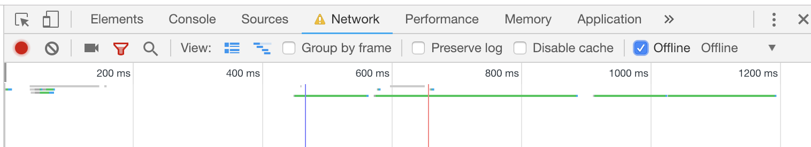
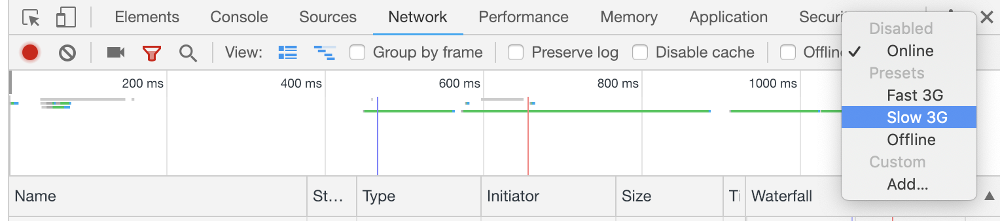

# Introduction

> Read 5 random articles then rate them with this React app.

## Table of Contents

1. [About](#about)
1. [Installation](#installation)
1. [Tests](#tests)
1. [Performance](#performance)
1. [Simulating Errors](#errors)
1. [Styling](#styling)
1. [Accessibility](#accessibility)

# About

This web app renders 1 random article at a time 5 times in controlled succession and allows a user to rank all of them by a rating system once they all have been read.

### Features:

- Fetches a random non-repeating article at a time
- Fetches the next article while the user is still reading the current article
- Rank all read articles once you read 5 of them by rating them individually in a Rankings page

### Preview:


### Live Demo: 

https://bbc-news-cf804.firebaseapp.com

# Installation

For Mac OS, Linux and Windows, from your terminal:

```sh
git clone https://github.com/GavBaros/articles.git
cd articles
npm install
npm start
```

# Tests

By default, all `'it'` and `'describe'` test descriptors will be visible on the terminal at runtime.

From your terminal:

```sh
npm run test
```

If you do not wish to see the test descriptors, simply run:

```sh
npm run test-silent
```

# Performance

[1]: https://reactjs.org/docs/code-splitting.html#reactlazy

Performance considerations such as making use of code-splitting through [React Lazy][1] have been made. While this may be unnecessary for such a small app, using code-splitting in this case demonstrates how this application can be performant as it scales.

Additionally, for a seamless user experience, the next random article is fetched while the user is still reading the current one rather than fetched each time the user navigates to a new article.

# Errors

Message alerts appear in the case of successfully posting data, network and status code errors.
Feel free to simulate errors while using the application.

#### To simulate an offline network error:

- Open the Chrome Developer Tools with `⌘ + ⌥ + C` for Mac OS and `Control + Shift + C` for Linux / Windows
- Select the `Network` tab
- Click on `Offline`



#### To simulate a slow connection:

- While still in Chrome Developer Tools, under the `Network` tab, click on `Online`
- When the small sub-menu appears, click on `Slow 3G`



# Styling

[2]: https://github.com/Semantic-Org/Semantic-UI-React

The [Semantic UI React][2] component library has been used for a highly scalable, ready-to-use and consistent styling across the app. This app is also fully responsive and fits to mobile screens.

#### Additional user experience implementations:

- Loading indicators are displayed while fetching and posting data.
- Button navigating to the next article is disabled and in a loading mode until the next article is actually fetched
- Feedback messages are given to the user when successfully posting data or when a network error occurs

# Accessibility

This app is fully accessible and passes Chrome Developer Tools's Accessibility audit with a score of 100%!

#### Specific implementations include:

- Using semantic HTML tags such as `<article>`, `<main>`, `<header>` and `<section>` throughout
- Images being wrapped with `<figure>` and `<figcaption>` tags as well as having `alt-text` attributes
- Buttons have an `aria-label` attribute
- Message alerts having a `role` attribute set to `alert`
